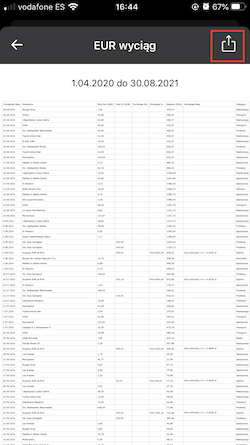
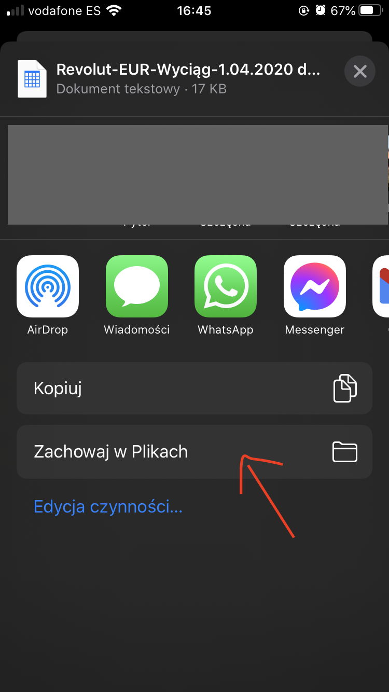

# RevolutBudget

A Dash web app for analyzing personal spending based on transactions exported from Revolut app.

*Uploaded transaction data is not stored anywhere, it is used just to generate the dashboard and discarded.*

**Important**: currently supporting only EUR accounts in iOS, Polish version of the Revolut app.
One day it might support Android, other currencies and languages, if I'm not lazy xD

# How to use
## Downloading the transactions from Revolut app
1. Open the Revolut app, then select the EUR account.
2. Click the "other options" button next to the account
 
3. 
4. 
5. 
6. 
7. 

## TODO - using the app
